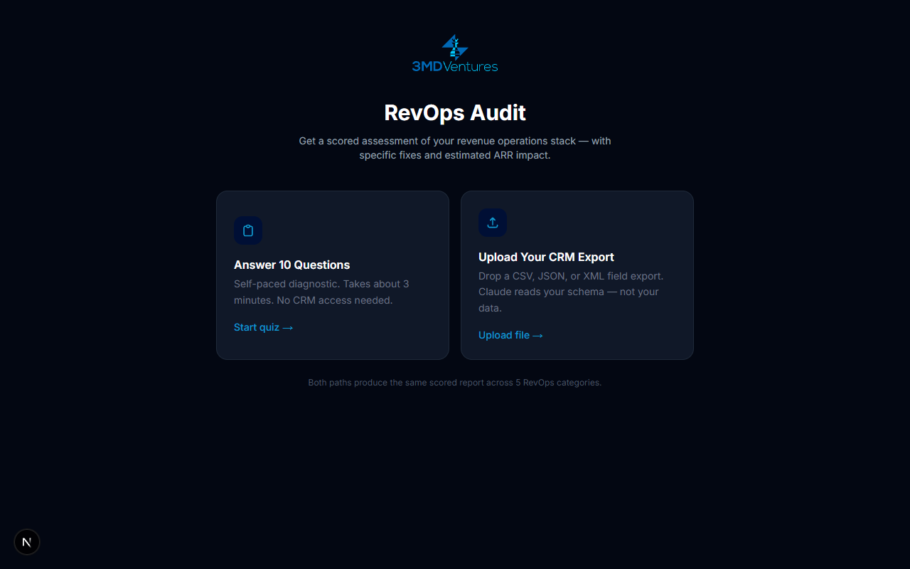

<p align="center">
  
</p>

# RevAudit — AI-Powered RevOps Audit Tool

Built by [3MD Ventures](https://www.3mdventures.com). A lead generation and qualification tool that scores a prospect's revenue operations stack across 5 categories using 10 diagnostic questions, generates a Claude-powered audit report, and delivers tailored recommendations with estimated ARR impact.

---

## Screenshots





---

## Customer Flow

```
Landing Page
    ↓
10-Question Diagnostic (self-paced, auto-advance)
    ↓
Metadata Step (CRM · Company Size · Industry · ARR optional)
    ↓
Email Gate ("Your report is ready")
    ↓
AI Audit Generation (~30 seconds)
    ↓
Scored Report (5 categories · top 3 fixes · ARR impact estimates)
    ↓
Calendly CTA ("Book a Free 30-Min Review")
```

**Parallel on submission:**
- User receives a concise thank-you email with their score, #1 fix, and booking link
- Milad receives a full internal lead intel email with complete findings, all category scores, and ARR impact per category
- Lead is logged to Google Sheets

---

## Scoring System

Scores are computed in code (not by the AI) using a per-answer weight table calibrated to real business risk. Claude receives the final scores and generates narrative only.

| Question | Topic | A | B | C | D |
|---|---|---|---|---|---|
| Q1 | Pipeline stage naming | 90 | 65 | 35 | 10 |
| Q2 | Loss reason tracking | 95 | 55 | 25 | 5 |
| Q3 | Lead source capture | 95 | 50 | 20 | 0 |
| Q4 | Source-to-revenue reporting | 90 | 55 | 20 | 5 |
| Q5 | Stale close date frequency | 90 | 65 | 30 | 5 |
| Q6 | CRM field validation | 95 | 60 | 30 | 10 |
| Q7 | Weekly review method | 90 | 55 | 20 | 0 |
| Q8 | QoQ pipeline comparison | 90 | 55 | 20 | 5 |
| Q9 | Renewal/expansion tracking | 90 | 60 | 30 | 5 |
| Q10 | Discount + churn tracking | 90 | 55 | 20 | 75* |

*Q10-D = "Not applicable" — neutral score, not penalized

Category score = average of its two questions. Overall = average of all 5 categories.

| Score | Label |
|---|---|
| 80–100 | Strong |
| 65–79 | Good |
| 45–64 | Needs Work |
| 25–44 | High Risk |
| 0–24 | Critical |

---

## Tech Stack

| Layer | Technology |
|---|---|
| Framework | Next.js 16 (App Router, TypeScript) |
| Styling | Tailwind CSS v4 with custom brand tokens |
| AI | Anthropic Claude (`claude-sonnet-4-6`) via `@anthropic-ai/sdk` |
| Lead Storage | Google Sheets API v4 via `googleapis` (OAuth2 refresh token) |
| Email | Nodemailer + Gmail SMTP (App Password auth) |
| Hosting | Local / deployable to Vercel |

---

## Infrastructure

### AI — Anthropic Claude
- Model: `claude-sonnet-4-6`, `max_tokens: 8192`
- Scores are pre-computed in `lib/claude.ts` and injected into the prompt
- Claude generates: summary headline, per-category findings, ARR impact estimates, top 3 fixes
- ARR-aware: if the user provides their ARR, Claude calculates dollar-specific impact; otherwise uses company size as a proxy
- Prompt enforces: 1-sentence findings, 1-liner ARR impact, 1-sentence fix descriptions

### Lead Storage — Google Sheets
- Sheet: configured via `GOOGLE_SHEET_ID`
- Tab: `RevAudit Leads` (auto-created on first submission)
- Columns: Timestamp · Email · Name · Overall Score · Risk Label · Summary Headline · CRM · Company Size · Industry · ARR · Answers JSON · Report JSON
- Auth: OAuth2 refresh token (no service account required — works within Google Workspace org policies)

### Email — Gmail SMTP
- Two emails fire on every submission (non-blocking, does not delay report delivery)
- **User email**: score, overall label, summary headline, #1 fix, Calendly CTA, Milad's contact info
- **Internal email** (to `milad@3mdventures.com`): submission announcement, full lead profile, score at a glance, all 5 category breakdowns with findings + ARR impact, top 3 fixes with effort/impact ratings
- Auth: Gmail App Password via Nodemailer

---

## Environment Variables

Create `.env.local` in the project root:

```env
# Anthropic
ANTHROPIC_API_KEY=sk-ant-...

# Google OAuth2 (for Sheets)
GOOGLE_CLIENT_ID=...
GOOGLE_CLIENT_SECRET=...
GOOGLE_REFRESH_TOKEN=...
GOOGLE_SHEET_ID=...

# Calendly
NEXT_PUBLIC_CALENDLY_URL=https://calendly.com/your-link

# Gmail SMTP
GMAIL_USER=you@yourdomain.com
GMAIL_APP_PASSWORD=xxxx xxxx xxxx xxxx
```

### Getting the Google Refresh Token

Run the one-time OAuth script (requires `GOOGLE_CLIENT_ID` and `GOOGLE_CLIENT_SECRET` to be set first):

```bash
node scripts/get-refresh-token.mjs
```

Sign in with your Google account, approve access, and paste the printed `GOOGLE_REFRESH_TOKEN` into `.env.local`.

### Getting the Gmail App Password

1. Enable 2-Step Verification on your Google account
2. Go to **myaccount.google.com → Security → App Passwords**
3. Create a password for "RevAudit"
4. Paste the 16-character password as `GMAIL_APP_PASSWORD`

---

## Local Development

```bash
npm install
npm run dev
```

Open [http://localhost:3000](http://localhost:3000).

A double-clickable launcher is included for both platforms:
- **Mac**: `RevAudit Launch.command`
- **Windows**: `RevAudit Launch.bat`

Both scripts install dependencies if needed, open the browser automatically, and start the dev server.

---

## Project Structure

```
app/
  page.tsx              # Landing page
  audit/page.tsx        # Audit flow state machine (form → capture → loading → report)
  api/audit/route.ts    # POST handler: generates report, fires Sheets + email

components/
  AuditForm.tsx         # 10-question form + metadata step
  EmailCapture.tsx      # Email gate shown before report
  AuditReport.tsx       # Full scored report UI

lib/
  claude.ts             # Score computation + Claude prompt + response parsing
  drive.ts              # Google Sheets lead logging
  email.ts              # User thank-you + internal lead intel emails

types/
  audit.ts              # AuditAnswers, AuditReport, CategoryResult, scoring helpers

scripts/
  get-refresh-token.mjs # One-time OAuth2 token generator for Google Sheets
```

---

---

## Business Requirements Document (BRD)

### Problem Statement
B2B sales and revenue leaders often don't know the true health of their revenue operations until a missed quarter forces a painful post-mortem. Auditing a CRM setup manually takes days, requires RevOps expertise, and produces generic findings. There is no fast, scalable way for 3MD Ventures to demonstrate the value of RevOps consulting before a prospect commits to an engagement.

### Business Objectives
1. Generate qualified inbound leads for 3MD Ventures RevOps consulting services
2. Demonstrate 3MD Ventures' expertise before any sales conversation
3. Create a shareable, viral-friendly tool for social distribution
4. Automate lead capture, scoring, and follow-up without manual intervention

### Target Users
- **Primary:** VP of Sales, CRO, RevOps Managers at B2B SaaS companies (11–500 employees, $500K–$50M ARR)
- **Secondary:** Founders and Sales Directors who own the CRM without a dedicated RevOps function

### User Goals
- Understand where their revenue operations are broken
- Quantify the dollar cost of those gaps
- Get a concrete prioritized fix list
- Book a call with 3MD Ventures if the findings resonate

### Business Goals
- Capture email + company profile of every respondent
- Surface high-intent leads (low scores = high urgency = easier close)
- Send Milad a real-time internal alert with full lead intel on every submission
- Log all leads to Google Sheets for CRM import and follow-up tracking

### Success Metrics
- Audit completion rate > 60%
- Email capture rate > 80% of completions
- Calendly booking rate > 15% of email captures
- Lead-to-opportunity conversion from audit > 20%

### Audit Path Options
1. **10-Question Diagnostic** — self-paced, auto-advance, no CRM access needed
2. **Schema Upload** — user uploads a CSV, JSON, or XML CRM field export; Claude infers scores from field structure

### Report Gating Strategy
- Overall score, ARR at Risk callout, and category scorecard are fully visible to all users
- Detailed findings for categories 1 and 2 are visible
- Categories 3–5 and all Top 3 Fixes are blurred — unlocked via a Calendly booking CTA
- Goal: give enough value to build credibility; withhold enough to drive the call

### Out of Scope (Current Version)
- Live CRM integrations (Salesforce, HubSpot, Monday.com) — planned post-public-deploy
- User accounts or persistent report history
- Payment or subscription gating

---

## Technical Requirements Document (TRD)

### Architecture Overview
Single-tenant Next.js 16 application (App Router, TypeScript) with serverless API routes. No database. All state is ephemeral per session.

### Audit Flow — State Machine
```
entry → form | upload → capture (email gate) → loading → report | error
```

| State | Component | Description |
|---|---|---|
| `entry` | `AuditEntry` | User chooses quiz or file upload |
| `form` | `AuditForm` | 10-question diagnostic, auto-advance on selection |
| `upload` | `SchemaUpload` | File drop zone + metadata; accepts CSV / JSON / XML ≤ 500 KB |
| `capture` | `EmailCapture` | Email gate before report is shown |
| `loading` | inline | Spinner while Claude generates |
| `report` | `AuditReport` | Scored report with blur gating |
| `error` | inline | Error state with restart |

### Scoring System (Quiz Path)
Scores are computed in `lib/claude.ts` using a calibrated per-question weight table — Claude does not compute scores. Claude receives pre-computed scores and generates narrative only.

| Category | Questions | Score Range |
|---|---|---|
| Pipeline Stage Design | Q1, Q2 | 0–100 |
| Lead Source Attribution | Q3, Q4 | 0–100 |
| Data Completeness | Q5, Q6 | 0–100 |
| Reporting Architecture | Q7, Q8 | 0–100 |
| Revenue Leakage | Q9, Q10 | 0–100 |

Overall score = average of all 5 categories.

### Scoring System (Schema Upload Path)
Claude receives raw file content (field names, types, picklists, required rules) and infers scores for all 5 categories based on what is and is not present in the schema. Output shape is identical to the quiz path.

### AI — Claude Integration
- Model: `claude-sonnet-4-6`
- Max tokens: 8192
- Two functions: `generateAudit(answers)` and `generateAuditFromSchema(text, context)`
- Both return a typed `AuditReport` object parsed from Claude's JSON response
- Prompt enforces JSON-only output; response is parsed with index-based extraction to handle any leading/trailing whitespace

### Report Output Shape
```typescript
AuditReport {
  overall_score: number           // 0–100
  overall_label: RiskLabel        // Critical | High Risk | Needs Work | Good | Strong
  summary_headline: string        // One sentence
  overall_arr_impact_amount: string  // Short dollar figure e.g. "$400K–$800K"
  overall_arr_impact: string      // One sentence explaining the risk
  categories: {
    [key: CategoryKey]: {
      score: number
      label: RiskLabel
      findings: string[]          // 3 items
      arr_impact: string          // One sentence with $ or %
    }
  }
  top_3_fixes: Fix[]              // rank, title, description, effort, impact
}
```

### Side Effects on Submission
All side effects are non-blocking (`.catch()` logged, never thrown to the client):

| Effect | Function | Failure Behavior |
|---|---|---|
| Log lead to Google Sheets | `saveLead()` | Logged, silent |
| Send user thank-you email | `sendThankYou()` | Logged, silent |
| Send internal lead intel email | `sendInternalSummary()` | Logged, silent |

### File Upload Security
- File is read client-side via `File.text()` — never written to disk or stored
- Transmitted as plain text in the POST body over HTTPS
- Max file size enforced client-side at 500 KB
- Accepted extensions: `.csv`, `.json`, `.xml`
- Claude receives field metadata only — the prompt explicitly instructs Claude to ignore any record-level data that may be present

### Email — Two Templates
1. **User thank-you** (`sendThankYou`): score, ARR at Risk callout, #1 fix, Calendly CTA, Milad's contact
2. **Internal lead intel** (`sendInternalSummary`): full lead profile, all 5 category scores + findings + ARR impact, top 3 fixes

### Google Sheets Lead Log
- Sheet: `GOOGLE_SHEET_ID` env var
- Tab: `RevAudit Leads` (auto-created)
- Columns: Timestamp · Email · Name · Overall Score · Risk Label · Summary · CRM · Company Size · Industry · ARR · Answers JSON · Report JSON

### Environment Variables
| Variable | Required | Purpose |
|---|---|---|
| `ANTHROPIC_API_KEY` | Yes | Claude API |
| `GOOGLE_CLIENT_ID` | Yes | Google OAuth2 |
| `GOOGLE_CLIENT_SECRET` | Yes | Google OAuth2 |
| `GOOGLE_REFRESH_TOKEN` | Yes | Google OAuth2 (no expiry) |
| `GOOGLE_SHEET_ID` | Yes | Lead logging sheet |
| `GMAIL_USER` | Yes | Nodemailer sender |
| `GMAIL_APP_PASSWORD` | Yes | Gmail SMTP auth |
| `NEXT_PUBLIC_CALENDLY_URL` | No | Calendly booking link |

### Planned: CRM Integrations (Post-Deploy)
OAuth 2.0 integrations with Salesforce, HubSpot, and Monday.com to replace manual schema export. Token held in memory only for the duration of the request. Read-only schema/metadata scopes exclusively — no record access.

---

Built in Austin, TX · [3mdventures.com](https://www.3mdventures.com)
