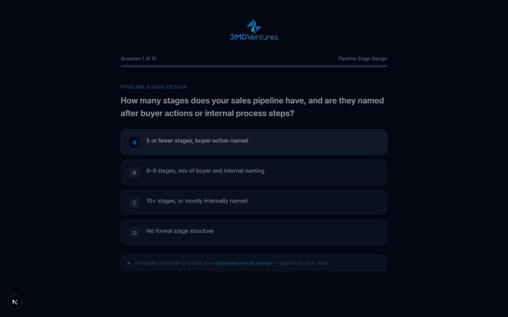
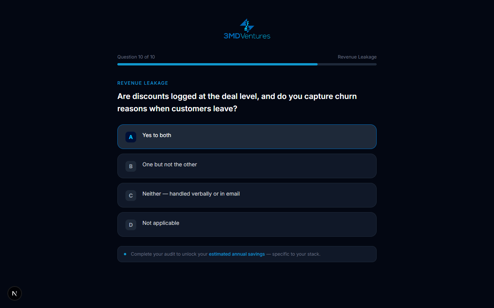
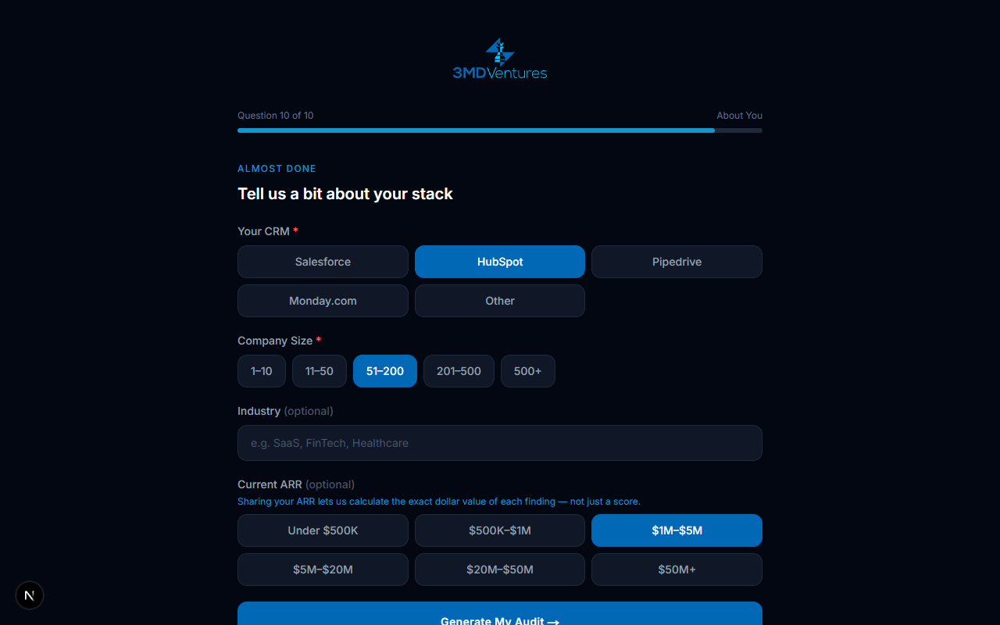
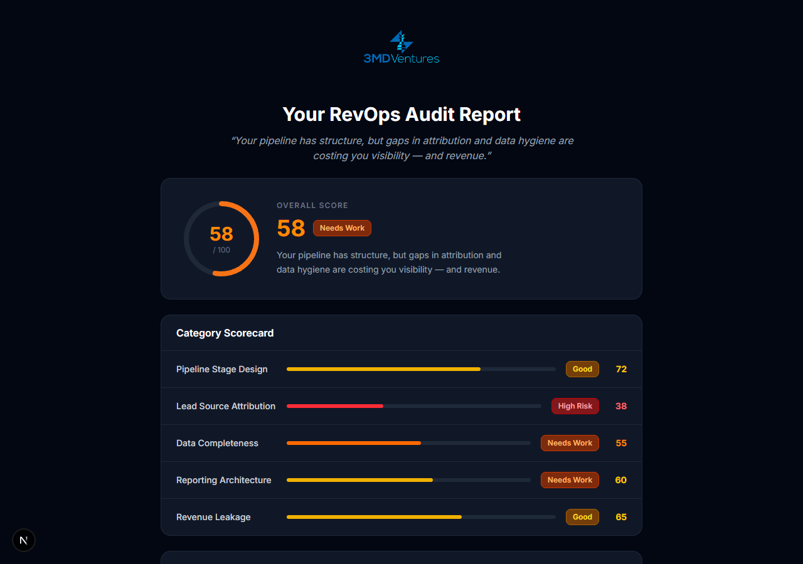

<p align="center">
  
</p>

# RevAudit — AI-Powered RevOps Audit Tool

Built by [3MD Ventures](https://www.3mdventures.com). A lead generation and qualification tool that scores a prospect's revenue operations stack across 5 categories using 10 diagnostic questions, generates a Claude-powered audit report, and delivers tailored recommendations with estimated ARR impact.

---

## Screenshots










---

## Customer Flow

```
Landing Page
    ↓
10-Question Diagnostic (self-paced, auto-advance)
    ↓
Metadata Step (CRM · Company Size · Industry · ARR optional)
    ↓
Email Gate ("Your report is ready")
    ↓
AI Audit Generation (~30 seconds)
    ↓
Scored Report (5 categories · top 3 fixes · ARR impact estimates)
    ↓
Calendly CTA ("Book a Free 30-Min Review")
```

**Parallel on submission:**
- User receives a concise thank-you email with their score, #1 fix, and booking link
- Milad receives a full internal lead intel email with complete findings, all category scores, and ARR impact per category
- Lead is logged to Google Sheets

---

## Scoring System

Scores are computed in code (not by the AI) using a per-answer weight table calibrated to real business risk. Claude receives the final scores and generates narrative only.

| Question | Topic | A | B | C | D |
|---|---|---|---|---|---|
| Q1 | Pipeline stage naming | 90 | 65 | 35 | 10 |
| Q2 | Loss reason tracking | 95 | 55 | 25 | 5 |
| Q3 | Lead source capture | 95 | 50 | 20 | 0 |
| Q4 | Source-to-revenue reporting | 90 | 55 | 20 | 5 |
| Q5 | Stale close date frequency | 90 | 65 | 30 | 5 |
| Q6 | CRM field validation | 95 | 60 | 30 | 10 |
| Q7 | Weekly review method | 90 | 55 | 20 | 0 |
| Q8 | QoQ pipeline comparison | 90 | 55 | 20 | 5 |
| Q9 | Renewal/expansion tracking | 90 | 60 | 30 | 5 |
| Q10 | Discount + churn tracking | 90 | 55 | 20 | 75* |

*Q10-D = "Not applicable" — neutral score, not penalized

Category score = average of its two questions. Overall = average of all 5 categories.

| Score | Label |
|---|---|
| 80–100 | Strong |
| 65–79 | Good |
| 45–64 | Needs Work |
| 25–44 | High Risk |
| 0–24 | Critical |

---

## Tech Stack

| Layer | Technology |
|---|---|
| Framework | Next.js 16 (App Router, TypeScript) |
| Styling | Tailwind CSS v4 with custom brand tokens |
| AI | Anthropic Claude (`claude-sonnet-4-6`) via `@anthropic-ai/sdk` |
| Lead Storage | Google Sheets API v4 via `googleapis` (OAuth2 refresh token) |
| Email | Nodemailer + Gmail SMTP (App Password auth) |
| Hosting | Local / deployable to Vercel |

---

## Infrastructure

### AI — Anthropic Claude
- Model: `claude-sonnet-4-6`, `max_tokens: 8192`
- Scores are pre-computed in `lib/claude.ts` and injected into the prompt
- Claude generates: summary headline, per-category findings, ARR impact estimates, top 3 fixes
- ARR-aware: if the user provides their ARR, Claude calculates dollar-specific impact; otherwise uses company size as a proxy
- Prompt enforces: 1-sentence findings, 1-liner ARR impact, 1-sentence fix descriptions

### Lead Storage — Google Sheets
- Sheet: configured via `GOOGLE_SHEET_ID`
- Tab: `RevAudit Leads` (auto-created on first submission)
- Columns: Timestamp · Email · Name · Overall Score · Risk Label · Summary Headline · CRM · Company Size · Industry · ARR · Answers JSON · Report JSON
- Auth: OAuth2 refresh token (no service account required — works within Google Workspace org policies)

### Email — Gmail SMTP
- Two emails fire on every submission (non-blocking, does not delay report delivery)
- **User email**: score, overall label, summary headline, #1 fix, Calendly CTA, Milad's contact info
- **Internal email** (to `milad@3mdventures.com`): submission announcement, full lead profile, score at a glance, all 5 category breakdowns with findings + ARR impact, top 3 fixes with effort/impact ratings
- Auth: Gmail App Password via Nodemailer

---

## Environment Variables

Create `.env.local` in the project root:

```env
# Anthropic
ANTHROPIC_API_KEY=sk-ant-...

# Google OAuth2 (for Sheets)
GOOGLE_CLIENT_ID=...
GOOGLE_CLIENT_SECRET=...
GOOGLE_REFRESH_TOKEN=...
GOOGLE_SHEET_ID=...

# Calendly
NEXT_PUBLIC_CALENDLY_URL=https://calendly.com/your-link

# Gmail SMTP
GMAIL_USER=you@yourdomain.com
GMAIL_APP_PASSWORD=xxxx xxxx xxxx xxxx
```

### Getting the Google Refresh Token

Run the one-time OAuth script (requires `GOOGLE_CLIENT_ID` and `GOOGLE_CLIENT_SECRET` to be set first):

```bash
node scripts/get-refresh-token.mjs
```

Sign in with your Google account, approve access, and paste the printed `GOOGLE_REFRESH_TOKEN` into `.env.local`.

### Getting the Gmail App Password

1. Enable 2-Step Verification on your Google account
2. Go to **myaccount.google.com → Security → App Passwords**
3. Create a password for "RevAudit"
4. Paste the 16-character password as `GMAIL_APP_PASSWORD`

---

## Local Development

```bash
npm install
npm run dev
```

Open [http://localhost:3000](http://localhost:3000).

A double-clickable launcher is included for both platforms:
- **Mac**: `RevAudit Launch.command`
- **Windows**: `RevAudit Launch.bat`

Both scripts install dependencies if needed, open the browser automatically, and start the dev server.

---

## Project Structure

```
app/
  page.tsx              # Landing page
  audit/page.tsx        # Audit flow state machine (form → capture → loading → report)
  api/audit/route.ts    # POST handler: generates report, fires Sheets + email

components/
  AuditForm.tsx         # 10-question form + metadata step
  EmailCapture.tsx      # Email gate shown before report
  AuditReport.tsx       # Full scored report UI

lib/
  claude.ts             # Score computation + Claude prompt + response parsing
  drive.ts              # Google Sheets lead logging
  email.ts              # User thank-you + internal lead intel emails

types/
  audit.ts              # AuditAnswers, AuditReport, CategoryResult, scoring helpers

scripts/
  get-refresh-token.mjs # One-time OAuth2 token generator for Google Sheets
```

---

Built in Austin, TX · [3mdventures.com](https://www.3mdventures.com)
